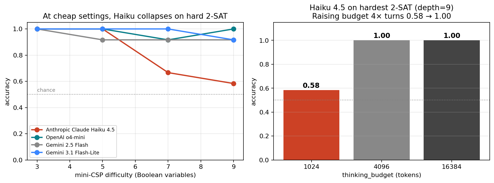

# depth-lens

> **Measure how reasoning depth × compute trades off — on your task, across vendors.**
> [日本語版](./README.ja.md)

[](LICENSE)
[](https://www.python.org/downloads/)
[](#status)



**The plot above is a real depth-lens output, generated for $0.50.** It shows
that Anthropic's Claude Haiku 4.5 — a frontier reasoning model — drops to
0.58 accuracy on hard 2-SAT instances at the *default* thinking budget, and
recovers to 1.00 when you 4× the budget. The other vendor cheap-tier models
(o4-mini, Gemini 3.1 Flash-Lite) don't show this gap. **You wouldn't know
this from MMLU.**

depth-lens is the small OSS tool that finds facts like this:

- Sweep your model's compute knob (`thinking_budget`, `reasoning_effort`,
  `n_loops`) across a depth-controllable task
- Get accuracy curves with Wilson 95% CIs, $/prediction, latency
- Auto-detect overthinking and effective-reasoning-depth ceilings
- Compare across **6 adapter families** on **5 built-in tasks** or your own JSONL

## Why this exists

Modern reasoning APIs all expose a "how hard to think" knob:

| Vendor | Knob | Range |
|---|---|---|
| Anthropic Claude | `thinking_budget_tokens` | 1024 – 32k |
| OpenAI o-series | `reasoning_effort` | low / medium / high |
| Google Gemini 3.x | `thinking_level` | low / medium / high |
| Looped transformers (OpenMythos) | `n_loops` | 1 – ∞ |

**MMLU and GSM8K give you one number.** They can't tell you whether your
production query needs `thinking_budget=1024` (cheap, fast) or `=16384`
(careful, expensive). depth-lens gives you the curve, on your task,
across vendors — and points out where the curve has a knee worth knowing
about.

We're not LLMThinkBench (HF-only, math-only, single operating point) and
we're not lm-eval-harness (no compute axis). We sit in the niche where
neither covers: **the cost-vs-quality curve of reasoning models on bounded-
depth probes you can swap for your own data**.

## 30-second install + first run

```bash
git clone https://github.com/yutoTachibana/depth-lens.git
cd depth-lens
pip install -e .[anthropic,openai,gemini]

export ANTHROPIC_API_KEY=...     # plus OPENAI_API_KEY / GOOGLE_API_KEY as needed

# Probe your own data
echo '{"prompt": "what is 7 + 35?", "target": "42", "depth": 1}' > my.jsonl
depth-lens probe \
    --model anthropic:claude-haiku-4-5 \
    --task custom:my.jsonl:first_int \
    --compute 1024,4096,16384 \
    --n-samples 16
```

```
effective depth (≥0.5 acc at some compute): 1
overthinking @ depth 1: peak=think=4096 (acc=1.00) → last=think=16384 (acc=0.94)
```

That's it. You now have a defensible answer to *"what thinking budget should
I use on this task?"* — backed by a real sweep with confidence intervals.

## Real findings the tool has produced

We ran depth-lens on every vendor we could get an API key for, on all 5
bundled tasks. Total spend: **~$11**. Time invested: **a single session**.

| Finding | Why it matters |
|---|---|
| [Haiku 4.5 collapses on hard 2-SAT at default budget](docs/findings/v1.0-mini-csp-cross-vendor.md) | If you use Haiku for constraint-style problems, set `budget≥4096` or pay 2× error rate |
| [Gemini 2.5 Flash → 3.1 Flash-Lite is the biggest leap of the 2025-26 generation](docs/findings/v1.0-gemini-3.x-cross-vendor.md) | Cheap-tier benchmarks done before May 2026 are now obsolete |
| [Claude Opus 4.7 cost varies 10× across (depth × budget) at fixed accuracy](docs/findings/v1.0-anthropic-cross-vendor.md) | Maxing the budget is a strict cost loss for many task classes |
| [OpenAI gpt-5-mini is cheaper-per-token but 3× slower than o4-mini](docs/findings/v1.0-openai-cross-vendor.md) | Latency-sensitive paths should pick o4-mini |
| [OpenMythos (looped transformer) extrapolates 1-2 hops past training depth](docs/findings/v0.5-openmythos.md) | Architecture-specific finding from the experiment that motivated the project |

**[→ See the full v1.0 cross-vendor summary](docs/findings/v1.0-cross-vendor-summary.md)**

## What's in the box

### 6 adapter families

| Spec | Compute knob | Cost basis |
|---|---|---|
| `anthropic:<model>` | `thinking_budget_tokens` | API |
| `openai:<model>` | `reasoning_effort` | API |
| `gemini:<model>` | `thinking_budget_tokens` (2.5) / auto-mapped to `thinking_level` (3.x) | API |
| `vllm:<model>` | `reasoning_effort` (OpenAI-compatible local server) | self-hosted |
| `hf:<hf-model-id>` | `max_thinking_tokens` (CoT length) | local GPU |
| `openmythos` | `n_loops` (Recurrent-Depth Transformer) | local GPU |

API adapters fan requests through a thread pool (`max_concurrent`); a
1000-prompt probe finishes in minutes, not hours.

### 5 built-in probe tasks

| Task | Depth axis | Reasoning shape |
|---|---|---|
| `k-hop` | K (operators) | Forward composition (mod-arithmetic) |
| `parity` | n (bits) | Aggregation (XOR reduction) |
| `graph-reach` | path length | Single BFS pass |
| `state-tracking` | K (instructions) | Vector state (2-counter register machine) |
| `mini-csp` | n (variables) | **Search / constraint propagation (2-SAT)** |
| `custom:<jsonl>:<scorer>` | optional `depth` field | **Bring your own data** |

Built-in scorers for `custom:`: `exact`, `first_int`, `last_int`, `yes_no`,
`contains`, `regex:<pattern>`. Verbose CoT outputs are parsed for
`Final answer: …` lines automatically.

### Diagnostics

Every `ProbeResult` exposes:

- `.accuracy` — `[depth][compute]` grid in `[0, 1]`
- `.ci()` — Wilson 95% intervals on every cell
- `.effective_depth(threshold=0.5)` — biggest depth where some compute level clears the bar
- `.overthinking(depth, tolerance=0.02)` — peak compute is not max compute, by how much
- `.cost_per_cell(pricing)` — $/prediction given a `{input, output, thinking}` USD-per-1M dict

## CLI

```bash
depth-lens probe ...     # one model
depth-lens compare ...   # several models, overlay plot
depth-lens dashboard     # Streamlit UI over your cached probes
```

[Full CLI reference](docs/cli.md) (auto-generated; see `--help` for now).

## Python API

```python
from depth_lens import probe
from depth_lens.tasks import get_task
from depth_lens.adapters.anthropic_adapter import AnthropicAdapter

task = get_task("mini-csp")
adapter = AnthropicAdapter(model="claude-haiku-4-5", task_name="mini-csp")
result = probe(adapter, task, depths=[3, 5, 7, 9], n_samples=16)

print(f"effective depth: {result.effective_depth(0.5)}")
print(f"overthinking @ d=9: {result.overthinking(9)}")
print(f"$/pred @ d=9 mid budget: {result.cost_per_cell({'input': 1.0, 'output': 5.0})[3, 1]}")
```

## How it compares to existing tools

| | LLMThinkBench | usail-hkust bench | o1 scaling laws | **depth-lens** |
|---|---|---|---|---|
| Compute-axis curves (not single point) | ❌ | partial | ✅ (o1 only) | **✅** |
| Cross-vendor (Claude / o-series / Gemini / OSS) | ❌ HF only | partial | ❌ o1 only | **✅** |
| Looped transformer (OpenMythos) | ❌ | ❌ | ❌ | **✅** |
| Bring-your-own JSONL | ❌ | ❌ | ❌ | **✅** |
| Cost per prediction with sweep | ❌ | ❌ | ❌ | **✅** |
| Bounded-depth synthetic probes | ❌ | partial | ❌ | **✅** |

Closest active competitor is [LLMThinkBench](https://github.com/ctrl-gaurav/LLMThinkBench)
which targets math-task overthinking on HuggingFace models at a fixed
operating point — orthogonal to depth-lens's compute-axis sweep across
vendor APIs.

## Status

- [x] **v0.1 MVP** — first end-to-end probe (May 2026)
- [x] **v0.5** — 4 tasks, 5 adapters, Wilson CIs, cache, Streamlit dashboard
- [x] **v1.0** — concurrent API eval, 5th task (mini-CSP), Gemini 3.x, full
  cross-vendor benchmark, multi-stage Docker, contributor docs, JA translation
- [ ] **v1.0 release** — PyPI publish, GitHub Actions CI

See [ROADMAP.md](./ROADMAP.md) for what's next.

## Install variants

```bash
# API-only (no GPU needed) — Anthropic, OpenAI, Gemini, dashboard
pip install -e .[anthropic,openai,gemini,dashboard]

# +looped transformer + HuggingFace local probes
pip install -e .[openmythos,huggingface,anthropic,openai,gemini,dashboard]

# Just the framework (BYO adapters)
pip install -e .
```

Python 3.11+. The bundled OpenMythos training helper assumes CUDA; everything
else is happy on CPU or against remote APIs.

## Contributing

See [CONTRIBUTING.md](./CONTRIBUTING.md) for how to add a Task or an Adapter
(both are ~50 lines + a test) and the conventions used in the bundled
implementations.

## Citation

```bibtex
@software{depth_lens_2026,
  title  = {depth-lens: Measuring Reasoning Depth Across Model Families},
  author = {yutoTachibana},
  year   = {2026},
  url    = {https://github.com/yutoTachibana/depth-lens}
}
```

## License

[MIT](./LICENSE).
