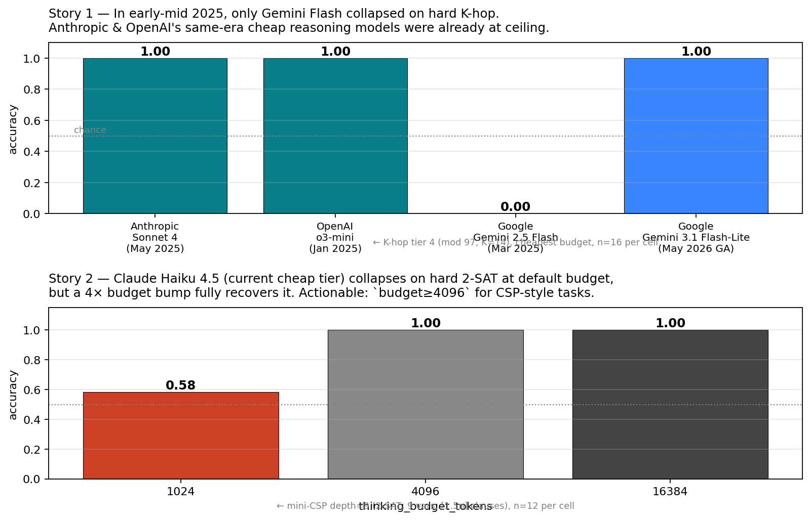

# depth-lens

> **Stop paying for Opus when Haiku does the job — prove it with ~$0.50 of API calls.**
>
> Production CI for LLM cost & quality. Sweep a reasoning model's thinking
> knob on **your data** and get the cheapest configuration that meets your
> accuracy bar. Cross-vendor (Anthropic / OpenAI / Gemini / OSS), with
> Wilson 95% CIs and per-call cost.
>
> [日本語版](./README.ja.md)

[](https://github.com/yutoTachibana/depth-lens/actions/workflows/test.yml)
[](LICENSE)
[](https://www.python.org/downloads/)
[](#status)



**Both plots above are real depth-lens outputs from a single benchmark
session (~$14 total spend).** Two practitioner-actionable facts neither
MMLU nor GSM8K can tell you:

1. **Story 1 (top)** — In early-mid 2025, only **Gemini 2.5 Flash**
   collapsed on the hardest K-hop tier among same-era cheap-tier
   reasoning models. Anthropic Sonnet 4 (May 2025) and OpenAI o3-mini
   (Jan 2025) were already at ceiling. depth-lens caught the
   vendor-specific anomaly; Gemini 3.1 Flash-Lite (May 2026 GA) has
   closed the gap.
2. **Story 2 (bottom)** — Claude Haiku 4.5 (current cheap tier) drops
   to 0.58 on hard 2-SAT at *default* thinking budget. A 4× budget bump
   fully recovers it. Actionable rule: **set `thinking_budget≥4096`
   when using Haiku on CSP-style workloads.**

depth-lens is the small OSS tool that finds facts like these:

- Sweep your model's compute knob (`thinking_budget` / `reasoning_effort` /
  `thinking_level` / `n_loops`) across a depth-controllable task
- Get accuracy curves with Wilson 95% CIs, $/prediction, latency
- Auto-detect overthinking and effective-reasoning-depth ceilings
- Compare across **6 adapter families** (Anthropic / OpenAI / Gemini /
  vLLM / HuggingFace / OpenMythos) on **5 built-in tasks** or your own JSONL

## Why this exists

You're running an LLM in production. **How do you know you picked the right
model?** Anthropic / OpenAI / Google each ship 3 tiers, each with a thinking
knob (`thinking_budget`, `reasoning_effort`, `thinking_level`). That's
9+ default configurations × N models. The instinct is *"use the latest /
biggest"* — and you can be **20× overpaying** for accuracy you'd get
from a cheap model anyway.

The 5 standard questions production teams ask:

1. *"Is Opus actually worth 20× the cost of Haiku for my workload?"*
2. *"We're paying $5k/mo on reasoning APIs — where can we cut?"*
3. *"Sonnet 4.7 just dropped — does it break the prompts we tuned for 4.6?"*
4. *"At what `thinking_budget` does accuracy plateau on our task?"*
5. *"My benchmarks say all models score 1.00 — am I missing a real difference?"*

depth-lens answers all five **on your own data**, in a session, for the
cost of a sandwich.

### What we don't do

- We don't run [MMLU](https://github.com/openai/simple-evals) or
  [GSM8K](https://github.com/openai/grade-school-math) — single numbers
  designed to crown frontier models. *Production teams already picked a
  model family; they need to tune within it.*
- We're not [LLMThinkBench](https://github.com/ctrl-gaurav/LLMThinkBench)
  (HF-only, math-only, single operating point).
- We're not [lm-eval-harness](https://github.com/EleutherAI/lm-evaluation-harness)
  (no compute axis).

We sit in the niche where none of the above covers: **the cost-vs-quality
curve of frontier reasoning APIs on data you actually run in production**.

## 30-second install + recommend the cheapest model

```bash
git clone https://github.com/yutoTachibana/depth-lens.git
cd depth-lens
pip install -e .[anthropic,openai,gemini]

export ANTHROPIC_API_KEY=...     # plus OPENAI_API_KEY / GOOGLE_API_KEY as needed

# Your production prompts → one JSONL line each
cat > my_eval.jsonl <<'EOF'
{"prompt": "Compute (47 * 23 + 19) mod 31.", "target": "5", "depth": 1}
{"prompt": "Compute ((11 * 7 - 4) * 3 + 2) mod 41.", "target": "26", "depth": 1}
EOF

# Find the cheapest model that hits 95% accuracy on YOUR data
depth-lens recommend \
    --models anthropic:claude-haiku-4-5,anthropic:claude-sonnet-4-6,anthropic:claude-opus-4-7 \
    --task custom:my_eval.jsonl:first_int \
    --target-accuracy 0.95 \
    --n-samples 32 \
    --daily-calls 10000
```

```
========================================================================================
Target accuracy ≥ 0.95
Probed 9 configurations, 8 passing.
========================================================================================

✅ Passing (cheapest first):
  anthropic:claude-haiku-4-5    d=1  thinking_budget_tokens=1024  acc=1.00  $0.000625/k-pred  ← cheapest
  anthropic:claude-haiku-4-5    d=1  thinking_budget_tokens=4096  acc=1.00  $0.000675/k-pred
  ...

========================================================================================
At 10,000 calls/day with the cheapest passing config:
  anthropic:claude-haiku-4-5 @ thinking_budget_tokens=1024
  → $6.25/day  $2,281/year

  Switching from anthropic:claude-opus-4-7 @ thinking_budget_tokens=16384 ($350/day)
  saves $344/day = $125,560/year (98% reduction)
```

That's it. You now have a defensible answer to *"is Opus actually
worth 20× the cost of Haiku for my workload?"* — backed by a real sweep
with Wilson 95% CIs.

> 💡 **What you're looking at**: depth-lens just ran every (model, budget)
> combination on your data, scored them against your target, ranked the
> passers by per-prediction cost, and projected the yearly savings vs the
> most-expensive passing config. That's the production-CI workflow this
> tool was built for.

## Real findings the tool has produced

We ran depth-lens on every vendor we could get an API key for, on all 5
bundled tasks — current generation **and** one generation back to keep
the cross-vendor comparison fair. Total spend: **~$14**. Time invested:
**a single session**.

| Finding | Why it matters |
|---|---|
| [Switching from Opus 4.7 to Haiku 4.5 saves ~$123k/year on a 10k-call/day task](docs/findings/v1.0-cost-savings.md) | The 4 concrete "tier-downgrade" savings switches depth-lens surfaces, in $ |
| [Haiku 4.5 collapses on hard 2-SAT at default budget](docs/findings/v1.0-mini-csp-cross-vendor.md) | If you use Haiku for constraint-style problems, set `budget≥4096` or pay 2× error rate |
| [Gemini 2.5 Flash was uniquely weak vs same-era Anthropic / OpenAI cheap reasoning](docs/findings/v1.0-cross-vendor-summary.md#five-structural-findings-depth-lens-surfaced) | When we tested 2025-era models from all 3 vendors, Anthropic Sonnet 4 (May 2025) and o3-mini (Jan 2025) were already at ceiling on K-hop. Only Gemini Flash collapsed. 3.1 Flash-Lite closes the gap. |
| [Claude Opus 4.7 cost varies 10× across (depth × budget) at fixed accuracy](docs/findings/v1.0-anthropic-cross-vendor.md) | Maxing the budget is a strict cost loss for many task classes |
| [OpenAI gpt-5-mini is cheaper-per-token but 3× slower than o4-mini](docs/findings/v1.0-openai-cross-vendor.md) | Latency-sensitive paths should pick o4-mini |
| [OpenMythos (looped transformer) extrapolates 1-2 hops past training depth](docs/findings/v0.5-openmythos.md) | Architecture-specific finding from the experiment that motivated the project |

**[→ See the full v1.0 cross-vendor summary](docs/findings/v1.0-cross-vendor-summary.md)**

## What's in the box

### 6 adapter families

| Spec | Compute knob | Cost basis |
|---|---|---|
| `anthropic:<model>` | `thinking_budget_tokens` | API |
| `openai:<model>` | `reasoning_effort` | API |
| `gemini:<model>` | `thinking_budget_tokens` (2.5) / auto-mapped to `thinking_level` (3.x) | API |
| `vllm:<model>` | `reasoning_effort` (OpenAI-compatible local server) | self-hosted |
| `hf:<hf-model-id>` | `max_thinking_tokens` (CoT length) | local GPU |
| `openmythos` | `n_loops` (Recurrent-Depth Transformer) | local GPU |

API adapters fan requests through a thread pool (`max_concurrent`); a
1000-prompt probe finishes in minutes, not hours.

### 5 built-in probe tasks

| Task | Depth axis | Reasoning shape |
|---|---|---|
| `k-hop` | K (operators) | Forward composition (mod-arithmetic) |
| `parity` | n (bits) | Aggregation (XOR reduction) |
| `graph-reach` | path length | Single BFS pass |
| `state-tracking` | K (instructions) | Vector state (2-counter register machine) |
| `mini-csp` | n (variables) | **Search / constraint propagation (2-SAT)** |
| `custom:<jsonl>:<scorer>` | optional `depth` field | **Bring your own data** |

Built-in scorers for `custom:`: `exact`, `first_int`, `last_int`, `yes_no`,
`contains`, `regex:<pattern>`. Verbose CoT outputs are parsed for
`Final answer: …` lines automatically.

### Diagnostics

Every `ProbeResult` exposes:

- `.accuracy` — `[depth][compute]` grid in `[0, 1]`
- `.ci()` — Wilson 95% intervals on every cell
- `.effective_depth(threshold=0.5)` — biggest depth where some compute level clears the bar
- `.overthinking(depth, tolerance=0.02)` — peak compute is not max compute, by how much
- `.cost_per_cell(pricing)` — $/prediction given a `{input, output, thinking}` USD-per-1M dict

## CLI

```bash
depth-lens recommend ... # find cheapest model meeting your accuracy bar (production workflow)
depth-lens probe ...     # detailed sweep of one model
depth-lens compare ...   # overlay several models on the same task
depth-lens dashboard     # Streamlit UI over your cached probes
```

Each subcommand has full `--help`. See [`docs/playbook/`](docs/playbook/)
for end-to-end production scenarios.

## Python API

```python
from depth_lens import probe
from depth_lens.tasks import get_task
from depth_lens.adapters.anthropic_adapter import AnthropicAdapter

task = get_task("mini-csp")
adapter = AnthropicAdapter(model="claude-haiku-4-5", task_name="mini-csp")
result = probe(adapter, task, depths=[3, 5, 7, 9], n_samples=16)

print(f"effective depth: {result.effective_depth(0.5)}")
print(f"overthinking @ d=9: {result.overthinking(9)}")
print(f"$/pred @ d=9 mid budget: {result.cost_per_cell({'input': 1.0, 'output': 5.0})[3, 1]}")
```

## How it compares to existing tools

| | LLMThinkBench | usail-hkust bench | o1 scaling laws | **depth-lens** |
|---|---|---|---|---|
| Compute-axis curves (not single point) | ❌ | partial | ✅ (o1 only) | **✅** |
| Cross-vendor (Claude / o-series / Gemini / OSS) | ❌ HF only | partial | ❌ o1 only | **✅** |
| Looped transformer (OpenMythos) | ❌ | ❌ | ❌ | **✅** |
| Bring-your-own JSONL | ❌ | ❌ | ❌ | **✅** |
| Cost per prediction with sweep | ❌ | ❌ | ❌ | **✅** |
| Bounded-depth synthetic probes | ❌ | partial | ❌ | **✅** |

Closest active competitor is [LLMThinkBench](https://github.com/ctrl-gaurav/LLMThinkBench)
which targets math-task overthinking on HuggingFace models at a fixed
operating point — orthogonal to depth-lens's compute-axis sweep across
vendor APIs.

## Status

- [x] **v0.1 MVP** — first end-to-end probe (May 2026)
- [x] **v0.5** — 4 tasks, 5 adapters, Wilson CIs, cache, Streamlit dashboard
- [x] **v1.0** — 6 adapter families, 5 tasks, full cross-vendor benchmark
  (Anthropic/OpenAI/Gemini, current + 2025 prior gen), multi-stage Docker,
  contributor docs, JA translation, GitHub Actions CI (lint + tests)
- [ ] **v1.0 release** — PyPI publish (you can already `pip install -e .` from source)

73 unit tests passing. See [ROADMAP.md](./ROADMAP.md) for what's next.

## Install variants

```bash
# API-only (no GPU needed) — Anthropic, OpenAI, Gemini, dashboard
pip install -e .[anthropic,openai,gemini,dashboard]

# +looped transformer + HuggingFace local probes
pip install -e .[openmythos,huggingface,anthropic,openai,gemini,dashboard]

# Just the framework (BYO adapters)
pip install -e .
```

Python 3.11+. The bundled OpenMythos training helper assumes CUDA; everything
else is happy on CPU or against remote APIs.

## Contributing

See [CONTRIBUTING.md](./CONTRIBUTING.md) for how to add a Task or an Adapter
(both are ~50 lines + a test) and the conventions used in the bundled
implementations.

## Citation

```bibtex
@software{depth_lens_2026,
  title  = {depth-lens: Measuring Reasoning Depth Across Model Families},
  author = {yutoTachibana},
  year   = {2026},
  url    = {https://github.com/yutoTachibana/depth-lens}
}
```

## License

[MIT](./LICENSE).
