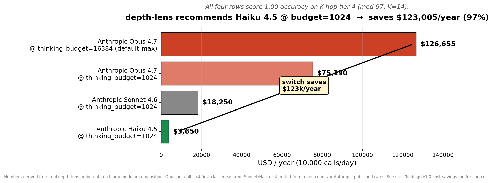
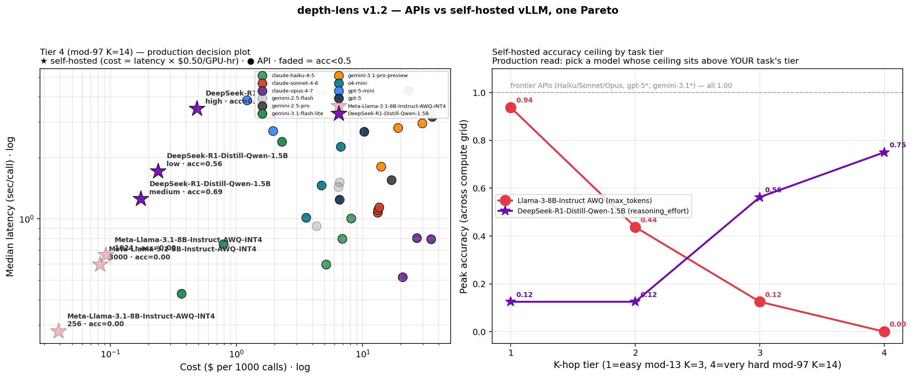

# depth-lens

> **The production decision tool for inference compute.**
> Three questions, one tool, real data on your workload.
>
> [日本語版](./README.ja.md)

[](https://github.com/yutoTachibana/depth-lens/actions/workflows/test.yml)
[](LICENSE)
[](https://www.python.org/downloads/)
[](#status)

Production teams running LLMs face the same three decisions, and the
typical answer is *"use whatever everyone else uses"*. depth-lens lets
you answer them with **a sweep on your data**, with Wilson 95% CIs and
per-call cost, in a single session for the price of a sandwich.

| You are asking… | depth-lens answers it by… | Evidence from our benches |
|---|---|---|
| **1. Which API tier / thinking budget should I be paying for?** | Sweep every (model, knob) on your prompts, rank passers by cost | Switching from Opus 4.7 to Haiku 4.5 saves **~$123k/year** on a 10k-call/day task — same accuracy ([finding](docs/findings/v1.0-cost-savings.md)) |
| **2. Should I self-host an open model instead of paying the API?** | Put API and vLLM points on **one Pareto** ($/M-token vs $/GPU-hour, same axis) | At K-hop tier 4 (mod-97 K=14), `gemini-3.1-flash-lite` beats every self-hosted candidate on the 4080 SUPER. At tier 1, self-hosted Llama-3-8B AWQ is the **cheapest passing config in the entire study** at $0.028/1k calls ([finding](docs/findings/v1.2-self-hosted-vs-api.md)) |
| **3. Is inference-time recursion (looped transformer) worth investing in for my workload?** | Probe token-CoT APIs and a looped transformer on the same task with the same accuracy axis | Within its training distribution, a **925K-param OpenMythos is ~10,000× faster than Claude at the same accuracy.** Outside it, the API dominates ([finding](docs/findings/v1.1-architecture-comparison.md)) |

## The hero finding — production CI saves five figures per task per year



**This plot is a real depth-lens output.** Four Anthropic configurations,
all scoring 1.00 accuracy on K-hop tier 4, ranged across **~35× in cost**.
That's the gap the *"use the latest / biggest"* instinct burns through
silently.

> Two other findings from the same bench:
> [Claude Haiku 4.5 collapses on hard 2-SAT at default budget but recovers at 4× budget](docs/findings/v1.0-mini-csp-cross-vendor.md)
> · [Gemini 2.5 Flash was uniquely weak in early 2025 vs same-era Anthropic / OpenAI cheap reasoning](docs/findings/v1.0-cross-vendor-summary.md#five-structural-findings-depth-lens-surfaced)

## Use case 1 — "Which API tier should we use?" (Production cost CI)

**You**: shipping a feature on Anthropic / OpenAI / Gemini. Each vendor
has 3 tiers × a thinking knob = 9+ configurations. The instinct is
*"use the latest / biggest"* — and you can be **20× overpaying** for
accuracy you'd get from the cheap tier anyway.

**What depth-lens gives you**:

- `depth-lens recommend` — single command that probes every (model, knob)
  combination on **your JSONL of prompts** and ranks the passers by cost
- Wilson 95% CIs on every cell so a 0.95 vs 0.93 comparison isn't a
  coin flip
- Per-call cost from the bundled pricing table + projected $/day, $/year
  at your traffic volume
- `--max-latency` to enforce a UX SLA (drop configs that pass accuracy
  but blow the speed budget)

**Backed by**: the [v1.0 cross-vendor summary](docs/findings/v1.0-cross-vendor-summary.md)
(every current-gen + 2025-era reasoning model on all 5 tasks, ~$14
total API spend). See [model-downgrade.md](docs/playbook/model-downgrade.md),
[cost-audit.md](docs/playbook/cost-audit.md),
[regression-detection.md](docs/playbook/regression-detection.md) for
end-to-end production playbooks.

## Use case 2 — "Should we self-host an open model?" (Build vs buy)

**You**: paying $X/month for an API at high call volume. Considering
running Llama / Qwen / DeepSeek on a single GPU instead. The question
is never *"is self-hosting good enough?"* in the abstract — it's
*"does the model whose ceiling sits above my task class win on $/call
at my SLA?"*

**What depth-lens gives you**:

- `vllm:<model>` adapter that targets any OpenAI-compatible local server.
  Two compute axes supported: `reasoning_effort` (thinking models like
  DeepSeek-R1-Distill, Qwen-Thinking) or `max_tokens` (instruct-only
  models like Llama-3-8B-Instruct).
- **GPU-hour pricing schema** in `cost_per_cell` — when the spec is
  `vllm:*` / `hf:*` / `openmythos`, cost per call is computed as
  `latency_seconds × $/GPU-hour / 3600`. Now self-hosted and API
  points land on the same cost axis on the same chart.
- Docker compose recipes for Llama-3-8B-Instruct AWQ and
  DeepSeek-R1-Distill-Qwen-1.5B that fit a 16 GB consumer GPU.

**Backed by**: [v1.2 — APIs vs self-hosted vLLM, one Pareto](docs/findings/v1.2-self-hosted-vs-api.md).
Headline: self-hosted models have an *opposite* accuracy ceiling pattern
— Llama-3-8B AWQ wins at tier 1 (cheapest passing config in the entire
study) and is **0% accurate** at tier 4. DeepSeek-R1-Distill-1.5B
(1.5B params!) is the opposite. Pick by ceiling, not by parameter count.



See also: [self-hosting-with-vllm.md playbook](docs/playbook/self-hosting-with-vllm.md).

## Use case 3 — "Does inference-time recursion scale?" (Architecture research)

**You**: a researcher or applied-ML engineer comparing inference-compute
paradigms. The 2026 open question is whether **latent-space recursion**
(looped transformers — OpenMythos, Parcae, Recurrent-Depth) can substitute
for **token-level CoT** (extended thinking APIs) at production scale.
Marketing claims from both sides; no one has measured them on the same
chart.

**What depth-lens gives you**:

| Paradigm | Implementation in depth-lens | Compute axis |
|---|---|---|
| Token-level CoT | `anthropic:*`, `openai:*`, `gemini:*`, `vllm:` thinking | `thinking_budget`, `reasoning_effort`, `thinking_level` |
| Latent-space recursion | `openmythos` (bundled) — trains a tiny model in 7 min if you don't have one | `n_loops` |

Same `probe()`, same accuracy axis, same Wilson CIs. **This is the only
OSS tool that compares both paradigms with the same instrument.**

**Backed by**: [v1.1 — Architecture head-to-head: latent recursion vs token-level CoT](docs/findings/v1.1-architecture-comparison.md).
Within OpenMythos's training distribution, a **925K-parameter looped
model is ~10,000× faster than Claude at the same accuracy**. Outside
the training distribution, the API dominates. The looped-transformer
thesis is supported — *bounded by training depth*. depth-lens makes
that boundary measurable on your data, not a marketing-deck assertion.

See also: [v1.1 OpenMythos saturation finding](docs/findings/v1.1-cost-vs-latency-per-vendor.md#openmythos-looping-pays-latency-but-the-more-loops--more-depth)
— the "infinite loops at inference" claim **doesn't replicate** past
the training `max_loop_iters`. depth-lens caught it; the architecture's
README had predicted it; we now have evidence.

## 30-second install + recommend the cheapest model

```bash
git clone https://github.com/yutoTachibana/depth-lens.git
cd depth-lens
pip install -e .[anthropic,openai,gemini]

export OPENAI_API_KEY=...     # plus ANTHROPIC_API_KEY / GOOGLE_API_KEY as needed

# Your production prompts → one JSONL line each
cat > my_eval.jsonl <<'EOF'
{"prompt": "Compute (47 * 23 + 19) mod 31.", "target": "15", "depth": 1}
{"prompt": "Compute ((11 * 7 - 4) * 3 + 2) mod 41.", "target": "16", "depth": 1}
{"prompt": "Compute (13 * 17 + 8) mod 29.", "target": "26", "depth": 1}
{"prompt": "Compute ((5 * 9 + 7) * 4 - 3) mod 23.", "target": "21", "depth": 1}
{"prompt": "Compute (100 - 7 * 11) mod 19.", "target": "4", "depth": 1}
EOF

# Find the cheapest model that hits 95% accuracy on YOUR data
depth-lens recommend \
    --models openai:gpt-5-mini,openai:o4-mini \
    --task custom:my_eval.jsonl:first_int \
    --target-accuracy 0.95 \
    --max-latency 3.0 \
    --n-samples 16 \
    --daily-calls 10000
```

```
============================================================================================
Target accuracy ≥ 0.95  ·  Max latency ≤ 3.00s/pred
Probed 6 configurations, 6 passing.
============================================================================================

✅ Passing (cheapest first):
  openai:gpt-5-mini     d=1  effort=low      acc=1.00   $0.354/k-pred   0.45s/pred  ← cheapest
  openai:gpt-5-mini     d=1  effort=medium   acc=1.00   $0.485/k-pred   0.59s/pred
  openai:o4-mini        d=1  effort=low      acc=1.00   $0.736/k-pred   0.29s/pred  ← fastest
  openai:gpt-5-mini     d=1  effort=high     acc=1.00   $0.886/k-pred   0.69s/pred
  openai:o4-mini        d=1  effort=medium   acc=1.00   $1.061/k-pred   0.37s/pred
  openai:o4-mini        d=1  effort=high     acc=1.00   $1.365/k-pred   0.40s/pred

⚡ Cost-vs-speed tradeoff among passing configs:
  Cheapest is 1.5× slower than fastest; fastest costs 2.1× more per call.

============================================================================================
At 10,000 calls/day with the cheapest passing config:
  openai:gpt-5-mini @ effort=low
  → $3.54/day  $1,291/year

  Switching from openai:o4-mini @ effort=high ($13.65/day)
  saves $10.11/day = $3,691/year (74% reduction)
```

That's it. You now have a defensible answer to *"do we need o4-mini @ high
effort, or is gpt-5-mini @ low good enough?"* — backed by a real sweep
with Wilson 95% CIs.

(Swap `--models` for `anthropic:claude-haiku-4-5,anthropic:claude-sonnet-4-6,anthropic:claude-opus-4-7`
to run the Opus→Haiku comparison that produced the hero plot above.
Same workflow, just provide the corresponding `ANTHROPIC_API_KEY`.)

To add a self-hosted candidate to the same comparison:

```bash
# Thinking model — same reasoning_effort knob as OpenAI o-series, mixes cleanly
docker compose -f docker/vllm-deepseek-r1-distill.yml up -d

depth-lens recommend \
    --models openai:o4-mini,vllm:deepseek-ai/DeepSeek-R1-Distill-Qwen-1.5B \
    --task custom:my_eval.jsonl:first_int \
    --target-accuracy 0.95 \
    --compute low,medium,high \
    --gpu-hourly-rate 0.50 \
    --n-samples 16 --daily-calls 10000
```

For an instruct-only model that doesn't accept `reasoning_effort`
(Llama-3-8B-Instruct, Mistral-7B, etc.), pass
`--compute-axis max_tokens` so the vLLM adapter sweeps response-length
caps instead:

```bash
docker compose -f docker/vllm-llama3-8b.yml up -d   # serve Llama-3-8B-Instruct AWQ

depth-lens recommend \
    --models openai:o4-mini,vllm:hugging-quants/Meta-Llama-3.1-8B-Instruct-AWQ-INT4 \
    --task custom:my_eval.jsonl:first_int \
    --target-accuracy 0.95 \
    --compute-axis max_tokens --compute 256,1024,3000 \
    --gpu-hourly-rate 0.50 \
    --n-samples 16 --daily-calls 10000
```

`--gpu-hourly-rate` makes the self-hosted point comparable; the default
is $0.50/GPU-hour (AWS g5 spot midpoint).

## Worked examples — depth-lens on real business tasks

Two production-style chatbot tasks we ran through the same `recommend`
workflow you just saw above. Both showed the same structural pattern: the
**"use the more capable model to be safe" default was a strict loss**,
and depth-lens located the optimal config at **~88% lower cost** while
keeping latency well under the typical chat-UI budget.

### Case 1 — Tenant inquiry urgency classifier (real-estate management)

A property-management chatbot classifies tenant messages into
`緊急 / 通常 / 翌営業日` (urgent / business hours / next business day).
20 realistic prompts spanning water leaks, gas leaks, lock loss, contract
questions, noise complaints, etc.

| Config | Accuracy | Latency p50 |
|---|---:|---:|
| **`openai:o4-mini @ effort=medium`** ← chosen | **100%** | **0.52 s** |
| `openai:gpt-5-mini @ effort=low` | 95% | 0.67 s |
| `openai:o4-mini @ effort=high` (default "safe") | 100% | 0.74 s |

- **Cost reduction**: ~88% vs. defaulting to `o4-mini @ high` or `gpt-5`.
- **Domain insight depth-lens surfaced**: the 95% config's single
  misclassification was 通常 → 翌営業日 (safe direction). No
  緊急 → 通常 errors — accuracy alone undersells the cheaper config's
  actual safety profile for this task.

### Case 2 — System monitoring quote estimator (MSP / IT operations)

An MSP chatbot computes monthly quote estimates from free-form Japanese
inquiries (plan tier × server count × options × volume discount).
**53 prompts across 5 difficulty tiers** including production-realistic
messy input (typos, formal/casual mixed, implicit tier hints like
"ミッションクリティカル" → premium).

| Config | All 5 tiers acc | Latency p50 |
|---|---:|---:|
| **`openai:gpt-5-mini @ effort=low`** ← chosen | **100% (53/53)** | **0.41 – 0.50 s** |
| `openai:o4-mini @ effort=medium` | 100% | 0.65 s |
| `openai:o4-mini @ effort=high` (default "safe") | 100% | 0.70 s |

- **Cost reduction**: ~88% vs. the "complex calculation needs a more
  capable model" intuition.
- **Counter-intuitive finding**: multi-step pricing math + production-
  realistic messy input both solved by the cheapest config.
  `gpt-5-mini @ low` handles compound discount logic, mixed plans, AND
  colloquial Japanese ("がっつり監視で") at 100%.

### Common pattern across both cases

1. **"Use the bigger model to be safe" is a strict loss** when measured
   — same accuracy, more cost, no latency budget gained.
2. **Stratified bench (simple → production-messy) reveals where each
   tier breaks** — or, as in Case 2, that none of the candidates do.
3. **~80-90% cost reduction is typical** when teams stop pre-judging
   model selection and run a quick depth-lens sweep instead.
4. **Production-realistic input must be in the bench from day 1.**
   Synthetic tier-1 prompts alone systematically over-recommend expensive
   models — Case 2's 30 messy "real-log-style" prompts were what
   produced the conclusion's confidence interval.

## All findings the tool has produced

We ran depth-lens on every vendor we could get an API key for, on all
5 bundled tasks — current generation **and** one generation back to
keep the cross-vendor comparison fair. Then we added self-hosted vLLM
and a looped transformer to the same Pareto. **Total spend: ~$14 API
+ ~30 min local GPU.**

### For use case 1 — API ops

| Finding | Why it matters |
|---|---|
| [Switching from Opus 4.7 to Haiku 4.5 saves ~$123k/year on a 10k-call/day task](docs/findings/v1.0-cost-savings.md) | The 4 concrete "tier-downgrade" savings switches depth-lens surfaces, in $ |
| [Cost vs latency: OpenAI gpt-5-mini cheaper-per-token but 3× slower than o4-mini at same accuracy](docs/findings/v1.0-cost-savings.md#cost-is-one-axis--latency-is-another) | Picking by $/token alone burns user-facing UX latency; the Pareto frontier on K-hop tier 4 has only 2 points |
| [Haiku 4.5 collapses on hard 2-SAT at default budget](docs/findings/v1.0-mini-csp-cross-vendor.md) | If you use Haiku for constraint-style problems, set `budget≥4096` or pay 2× error rate |
| [Gemini 2.5 Flash was uniquely weak vs same-era Anthropic / OpenAI cheap reasoning](docs/findings/v1.0-cross-vendor-summary.md#five-structural-findings-depth-lens-surfaced) | When we tested 2025-era models, Anthropic Sonnet 4 (May 2025) and o3-mini (Jan 2025) were at ceiling on K-hop. Only Gemini Flash collapsed. 3.1 Flash-Lite closes the gap |
| [Claude Opus 4.7 cost varies 10× across (depth × budget) at fixed accuracy](docs/findings/v1.0-anthropic-cross-vendor.md) | Maxing the budget is a strict cost loss for many task classes |
| [Per-vendor cost-vs-latency plots (Anthropic / OpenAI / Gemini)](docs/findings/v1.1-cost-vs-latency-per-vendor.md) | One scatter per vendor — Pareto frontier vs. budget knobs |

### For use case 2 — Build vs buy

| Finding | Why it matters |
|---|---|
| [**Self-hosted vLLM (Llama-3-8B / DeepSeek-R1-Distill) vs hosted APIs — one Pareto**](docs/findings/v1.2-self-hosted-vs-api.md) | Llama-3-8B AWQ self-hosted is the **cheapest passing config in the entire study at tier 1** ($0.028/1k calls), but **0% accuracy at tier 4**. DeepSeek-R1-Distill-1.5B hits 0.75 on tier 4. gemini-3.1-flash-lite dominates everything at tier 4 ($0.11/1k calls, 1.00 acc). depth-lens makes build-vs-buy a chart, not a guess |

### For use case 3 — Architecture / paradigm research

| Finding | Why it matters |
|---|---|
| [**v2.0 — A tool for measuring 3 inference-time-compute paradigms on one FLOPs axis**](docs/findings/v2.0-scaling-law.md) | The contribution: **infrastructure** to sweep Token-CoT API · Self-hosted vLLM · Looped (OpenMythos 1M/10M/100M) across 5 tasks with one OSS, producing reproducible probe JSONs. The headline ratio (1M-looped beats gpt-5-mini by ~410,000× FLOPs on bounded-depth synthetic tasks) is a deep-learning-101 result — a specialized model trained on a narrow task beating a frontier generalist *on that task* is what we'd expect since LeNet/MNIST. **The novelty is the tool that lets you measure it for your task, not the result.** For production decisions, stay with v1.0-v1.2 findings (use the cheap API tier). |
| [**OpenMythos (latent recursion) vs Claude (token CoT) head-to-head**](docs/findings/v1.1-architecture-comparison.md) | Within training distribution, a 925K-param looped model is **~10,000× faster than Claude at same accuracy**. Outside it, the API dominates |
| [OpenMythos loops-vs-accuracy saturation](docs/findings/v1.1-cost-vs-latency-per-vendor.md#openmythos-looping-pays-latency-but-the-more-loops--more-depth) | The looped-transformer "more loops = deeper reasoning" claim **saturates** at `training_max_loop_iters`; latency keeps growing, accuracy doesn't |
| [OpenMythos extrapolates 1-2 hops past training depth on K-hop](docs/findings/v0.5-openmythos.md) | The seed experiment that motivated the project — same data, same axes |

**[→ See the full v1.0 cross-vendor summary](docs/findings/v1.0-cross-vendor-summary.md)**

## What's in the box

### 6 adapter families

| Spec | Compute knob | Cost basis |
|---|---|---|
| `anthropic:<model>` | `thinking_budget_tokens` | API |
| `openai:<model>` | `reasoning_effort` | API |
| `gemini:<model>` | `thinking_budget_tokens` (2.5) / auto-mapped to `thinking_level` (3.x) | API |
| `vllm:<model>` | `reasoning_effort` for thinking models or `max_tokens` for instruct-only (OpenAI-compatible local server) | self-hosted ($/GPU-hour) |
| `hf:<hf-model-id>` | `max_thinking_tokens` (CoT length) | local GPU ($/GPU-hour) |
| `openmythos` | `n_loops` (Recurrent-Depth Transformer) | local GPU ($/GPU-hour) |

API adapters fan requests through a thread pool (`max_concurrent`); a
1000-prompt probe finishes in minutes, not hours.

### 5 built-in probe tasks

| Task | Depth axis | Reasoning shape |
|---|---|---|
| `k-hop` | K (operators) | Forward composition (mod-arithmetic) |
| `parity` | n (bits) | Aggregation (XOR reduction) |
| `graph-reach` | path length | Single BFS pass |
| `state-tracking` | K (instructions) | Vector state (2-counter register machine) |
| `mini-csp` | n (variables) | **Search / constraint propagation (2-SAT)** |
| `custom:<jsonl>:<scorer>` | optional `depth` field | **Bring your own data** |

Built-in scorers for `custom:`: `exact`, `first_int`, `last_int`, `yes_no`,
`contains`, `regex:<pattern>`. Verbose CoT outputs are parsed for
`Final answer: …` lines automatically.

**`llm:<judge-model>:<criterion>` — LLM-as-judge scorer** for open-ended
tasks (summaries, free-form Q&A, multi-criterion checks) where exact
match doesn't apply. Built-in criteria: `correct` / `faithful` /
`helpful` / `concise` / `format` / `polite`. Free-form rubrics via
`llm:<judge-model>:rubric:<text>`. Example:

```bash
depth-lens recommend \
    --models openai:gpt-5-mini,openai:o4-mini \
    --task "custom:./summaries.jsonl:llm:openai:gpt-5-mini:faithful" \
    --target-accuracy 0.85 --n-samples 32
```

Always pick a different (and ideally cheaper) judge model than the
model under test, to avoid self-judging bias. Judge cost is real —
gemini-3.1-flash-lite is the cheapest competent judge as of 2026.

### Diagnostics

Every `ProbeResult` exposes:

- `.accuracy` — `[depth][compute]` grid in `[0, 1]`
- `.ci()` — Wilson 95% intervals on every cell
- `.effective_depth(threshold=0.5)` — biggest depth where some compute level clears the bar
- `.overthinking(depth, tolerance=0.02)` — peak compute is not max compute, by how much
- `.cost_per_cell(pricing)` — $/prediction. Accepts both token-based pricing
  (`{input, output}` USD-per-1M) and GPU-hour pricing
  (`{gpu_hourly, gpus}`) — pick whichever fits the adapter

## CLI

```bash
depth-lens recommend ... # find cheapest model meeting your accuracy bar (production workflow)
depth-lens probe ...     # detailed sweep of one model
depth-lens compare ...   # overlay several models on the same task
depth-lens dashboard     # Streamlit UI over your cached probes
```

Each subcommand has full `--help`. See [`docs/playbook/`](docs/playbook/)
for end-to-end production scenarios.

## Python API

```python
from depth_lens import probe
from depth_lens.tasks import get_task
from depth_lens.adapters.anthropic_adapter import AnthropicAdapter

task = get_task("mini-csp")
adapter = AnthropicAdapter(model="claude-haiku-4-5", task_name="mini-csp")
result = probe(adapter, task, depths=[3, 5, 7, 9], n_samples=16)

print(f"effective depth: {result.effective_depth(0.5)}")
print(f"overthinking @ d=9: {result.overthinking(9)}")
print(f"$/pred @ d=9 mid budget: {result.cost_per_cell({'input': 1.0, 'output': 5.0})[3, 1]}")
```

## What this is not — and how it compares

depth-lens is intentionally narrow. It does **not** run
[MMLU](https://github.com/openai/simple-evals) or
[GSM8K](https://github.com/openai/grade-school-math) — single numbers
designed to crown frontier models. It does not test "is the model
smart" (production teams already picked a model family). It tests
**which configuration of that family meets your accuracy bar at the
lowest cost / latency / GPU-time**.

| | LLMThinkBench | usail-hkust bench | o1 scaling laws | **depth-lens** |
|---|---|---|---|---|
| Compute-axis curves (not single point) | ❌ | partial | ✅ (o1 only) | **✅** |
| Cross-vendor (Claude / o-series / Gemini / OSS) | ❌ HF only | partial | ❌ o1 only | **✅** |
| Looped transformer (OpenMythos) | ❌ | ❌ | ❌ | **✅** |
| Self-hosted vLLM on same axis as APIs | ❌ | ❌ | ❌ | **✅** |
| Bring-your-own JSONL | ❌ | ❌ | ❌ | **✅** |
| Cost per prediction with sweep | ❌ | ❌ | ❌ | **✅** |
| Bounded-depth synthetic probes | ❌ | partial | ❌ | **✅** |

Closest active competitor is [LLMThinkBench](https://github.com/ctrl-gaurav/LLMThinkBench)
which targets math-task overthinking on HuggingFace models at a fixed
operating point — orthogonal to depth-lens's compute-axis sweep across
vendor APIs.

## Status

- [x] **v0.1 MVP** — first end-to-end probe (May 2026)
- [x] **v0.5** — 4 tasks, 5 adapters, Wilson CIs, cache, Streamlit dashboard
- [x] **v1.0** — 6 adapter families, 5 tasks, full cross-vendor benchmark
  (Anthropic/OpenAI/Gemini, current + 2025 prior gen), multi-stage Docker,
  contributor docs, JA translation, GitHub Actions CI (lint + tests)
- [x] **v1.1** — OpenMythos head-to-head; cross-paradigm Pareto
- [x] **v1.2** — self-hosted vLLM with GPU-hour pricing on the same Pareto
- [x] **v2.0** — 3-paradigm FLOPs-vs-accuracy scaling law (Looped × vLLM × Token-CoT API), `dict-lookup` task, `depth_lens.flops` module, full 35-cell measurement run committed
- [ ] **v2.1** — PyPI publish, code-generation task, more adapters (Bedrock / Groq / Together)

100+ unit tests passing. See [ROADMAP.md](./ROADMAP.md) for what's next.

## Install variants

```bash
# API-only (no GPU needed) — Anthropic, OpenAI, Gemini, dashboard
pip install -e .[anthropic,openai,gemini,dashboard]

# +looped transformer + HuggingFace local probes
pip install -e .[openmythos,huggingface,anthropic,openai,gemini,dashboard]

# +self-hosted vLLM (assumes vLLM is running separately via docker compose)
pip install -e .[anthropic,openai,gemini,dashboard]   # OpenAI SDK is all that's needed client-side

# Just the framework (BYO adapters)
pip install -e .
```

Python 3.11+. The bundled OpenMythos training helper assumes CUDA;
everything else is happy on CPU or against remote APIs.

## Contributing

See [CONTRIBUTING.md](./CONTRIBUTING.md) for how to add a Task or an Adapter
(both are ~50 lines + a test) and the conventions used in the bundled
implementations.

## Citation

```bibtex
@software{depth_lens_2026,
  title  = {depth-lens: Measuring Reasoning Depth Across Model Families},
  author = {yutoTachibana},
  year   = {2026},
  url    = {https://github.com/yutoTachibana/depth-lens}
}
```

## License

[MIT](./LICENSE).
