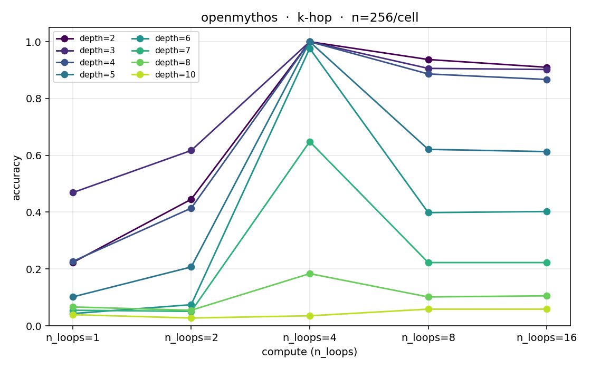
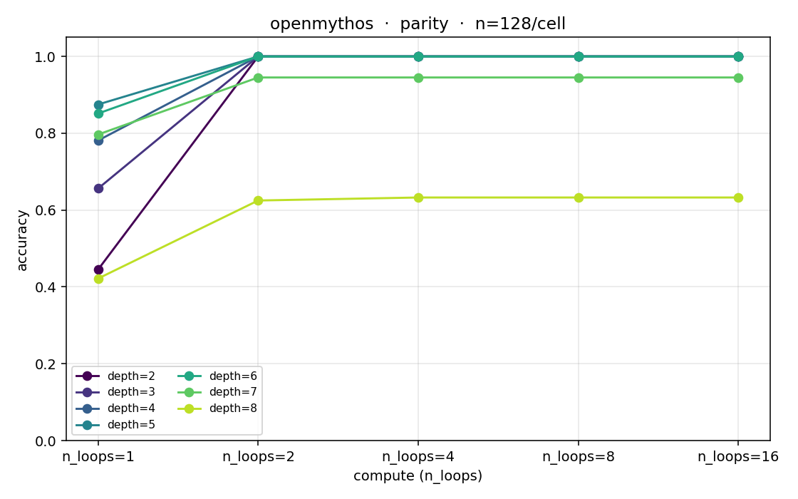
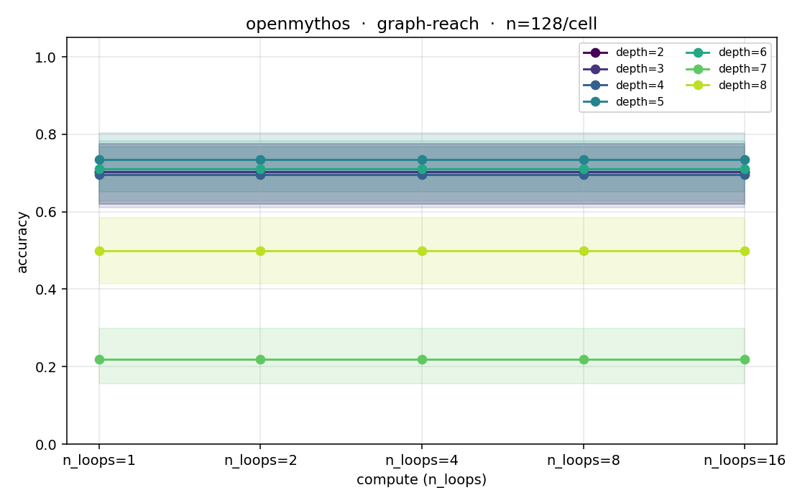
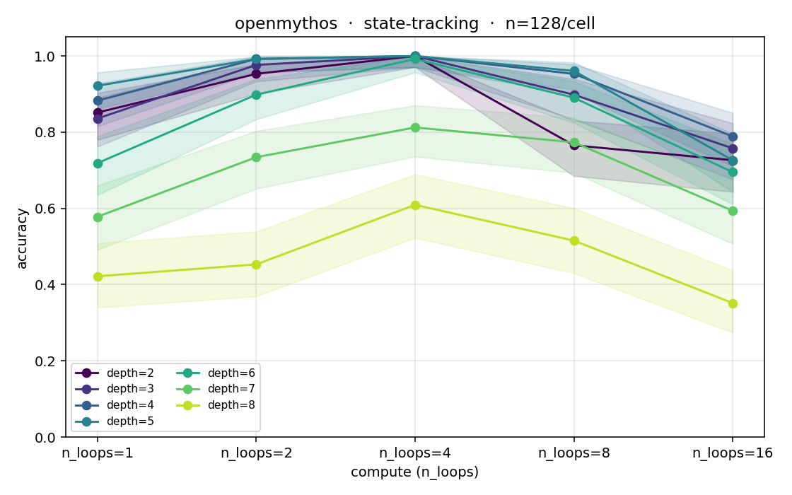

# v0.5 — OpenMythos across four tasks

This page is the published artefact of the v0.5 OpenMythos probe sweep.
Each plot is the output of a single `depth-lens probe --model openmythos
--task <task>` run; the underlying probe JSONs sit next to the figures.

All four runs use the **same** tiny 925K-parameter OpenMythos (one model per
task, trained from scratch with `train_for_task`, K_train ∈ [2..6],
max_loop_iters = 4). Task depth × n_loops is swept at inference; the
y-axis is accuracy with Wilson 95% CIs shaded.

What we want you to notice: **the four tasks produce four qualitatively
different compute-scaling profiles.** That fact is not visible in a
single-number benchmark.

---

## K-hop modular composition



- **Profile:** strong overthinking. Accuracy peaks at the training loop
  count (4) and decays past it.
- **effective_depth (≥0.5):** 7
- **Interpretation:** the model has committed to its answer by the end of
  training-depth recurrence; further loops drift the hidden state past
  the solution.

## Parity



- **Profile:** clean monotonic improvement up to training depth, then
  flat. No overthinking detected at any depth ≤ 6.
- **effective_depth (≥0.5):** 8
- **Interpretation:** every loop is used productively until convergence;
  extra compute is harmless but not helpful.

## Graph reachability



- **Profile:** *no* compute benefit. Loops 1, 2, 4, 8, 16 all produce
  ~0.70 accuracy on in-distribution depths.
- **effective_depth (≥0.5):** 8 (but at a 0.70 ceiling, not 1.00)
- **Interpretation:** the model didn't learn the recursive algorithm —
  it found a ~70% heuristic and stopped. Adding more loops will never
  cross the heuristic. Different architecture / training is needed.

## Two-counter state tracking



- **Profile:** overthinking like K-hop (peak at loops=4, decay past it),
  but extrapolation degrades gracefully rather than collapsing — K=8 is
  still 0.61 at peak compute.
- **effective_depth (≥0.5):** 8
- **Interpretation:** the vector-valued state can't be memorized as
  easily as K-hop's single integer, so the model is forced to learn
  composition. K-hop appears to memorise; state-tracking actually
  generalises.

---

## What this is and isn't

This is **not** a model leaderboard. It's the same architecture trained
end-to-end on four different tasks, on a single consumer GPU, in a few
hours total. The differences across panels are differences *between
tasks*, not between models.

What it shows is that depth-lens automates exactly the kind of finding
that's tedious to extract by hand: *for any model you give it, on any of
the bundled tasks, what is the shape of its compute-scaling curve, and
what does it say about whether the model has learned composition or just
memorised one depth?*

We'll publish the corresponding multi-model leaderboard in v1.0 once the
API-budget benchmark sweep runs.

## Reproducing

```bash
git clone https://github.com/yutoTachibana/depth-lens.git
cd depth-lens
pip install -e .[openmythos,huggingface]

for task in k-hop parity graph-reach state-tracking; do
  depth-lens probe --model openmythos --task $task \
    --depths 2,3,4,5,6,7,8 --compute 1,2,4,8,16 \
    --train-steps 5000 --n-samples 128 --batch-size 64 \
    --plot runs/probe_${task}.png \
    --save-checkpoint runs/openmythos_${task}.pt
done
```

Wall time on RTX 4080 SUPER 16GB: ~7 min per task (training + probing).
