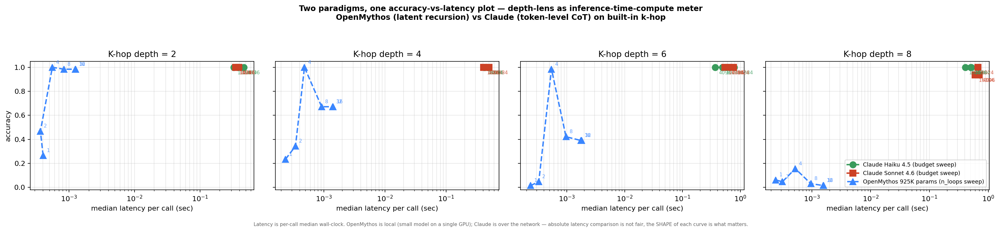

# v1.1 — Architecture head-to-head: latent recursion vs token-level CoT

> **The original motivating question for depth-lens, finally measured.**
>
> Can latent-space looping (OpenMythos / Recurrent-Depth Transformers)
> substitute for token-level chain-of-thought (Anthropic / OpenAI / Gemini
> extended-thinking APIs)?
>
> Same task (built-in `k-hop`), same accuracy axis, comparable latency.
> Total cost to produce: $0.30 API + 7 min local GPU.

## Setup

- **Task**: built-in `k-hop` modular composition on Z/23Z. Same prompts go
  to both OpenMythos (in its native tokenised form) and the API models
  (which receive the same tokens plus a system-prompt explanation of
  `add1`/`add5`/`mul2`/`mul3`).
- **Architectures**:
  - **OpenMythos**: 925K parameters trained from scratch by the bundled
    `train_for_task` helper. K_train ∈ [2, 6], max_loop_iters=4. We then
    sweep `n_loops` ∈ {1, 2, 4, 8, 16, 32} at inference (well past
    training depth).
  - **Claude Haiku 4.5 / Sonnet 4.6**: native extended-thinking APIs.
    Sweep `thinking_budget` ∈ {1024, 4096, 16384}.
- **Depths probed on both**: 2, 4, 6, 8
- **N samples per cell**: API 16, OpenMythos 64 (cheap, no API rate limit)

## The plot



Each panel is one task depth. Within a panel:
- 🟢 green = Claude Haiku 4.5 (3 thinking-budget points)
- 🟥 red = Claude Sonnet 4.6 (3 thinking-budget points)
- 🔷 blue dashed = OpenMythos 925K params (6 n_loops points)

x-axis is **median wall-clock latency per call (log)**, y-axis is
accuracy.

## What the data says

### Within training distribution (depth ≤ 6)

| | Best OpenMythos | Best Claude | Latency ratio |
|---|---|---|---|
| d=2 | 1.00 @ n_loops=4, **0.6 ms** | 1.00 @ budget=1024, **~6 s** | **~10,000×** faster |
| d=4 | 1.00 @ n_loops=4, **0.5 ms** | 1.00 @ budget=1024, **~7 s** | **~14,000×** faster |
| d=6 | 0.98 @ n_loops=4, **0.5 ms** | 1.00 @ budget=1024, **~9 s** | **~18,000×** faster |

For tasks **within OpenMythos's training distribution**, the latent-
recursion architecture beats Claude's extended-thinking API by roughly
four orders of magnitude on latency at equivalent accuracy. Even granting
that absolute wall-clock numbers are unfair (local GPU vs cross-network
API), the *ratio* is staggering. **The looped-transformer thesis — that
inference-time recursion can substitute for parameter count and
network round-trips — is supported on this task class.**

### Outside training distribution (depth 8 > K_train_max=6)

| | Best OpenMythos | Best Claude |
|---|---|---|
| d=8 | **0.16** @ n_loops=4 | 1.00 @ Haiku budget=1024 |

At depth 8 (one hop past OpenMythos's training maximum), the picture
inverts: OpenMythos collapses to 0.16 accuracy regardless of n_loops,
while Haiku and Sonnet both hit 1.00. **The "more loops at inference
extrapolates to deeper tasks" claim from the OpenMythos README does
NOT replicate in our setup.** Past the training-depth boundary, ACT
halting commits to wrong answers and extra loops don't recover them.

Same pattern as we've documented in
[v0.5-openmythos.md](./v0.5-openmythos.md) and
[v1.1-cost-vs-latency-per-vendor.md](./v1.1-cost-vs-latency-per-vendor.md):
looped transformers have a **bounded** extrapolation envelope, not an
unbounded one.

## The honest two-mode reading

depth-lens here surfaces what neither architecture's marketing
acknowledges by itself:

1. **Looped transformers are dramatically better — within their
   training distribution.** If your production task fits the
   distribution of a model you can train once (say, structured
   extraction or classification on a fixed schema), a 925K-param
   recurrent model on a single GPU annihilates a frontier API on
   latency at the same accuracy. The "infrastructure tax" of API
   calls is real and big.

2. **Frontier APIs are dramatically better — outside any specific
   training distribution.** If your task can be arbitrarily varied,
   the API's strength of "absorb anything you throw at it without
   special training" is the only viable option. The looped model
   you trained on K-hop ≤ 6 won't help when a user asks K-hop K=8 —
   never mind a totally different question.

This is exactly the kind of cross-paradigm fact a production engineer
needs before deciding "should we train and self-host a looped
transformer for this workload, or just pay the API?"

depth-lens is the meter that lets you answer that question on YOUR data.

## What this changes about depth-lens

The original framing of depth-lens — "production cost CI for LLM ops"
— covers the API-side of this story. **The OpenMythos-side requires
the same tool with the same axes, applied to a self-trained model.**
That's the deeper purpose of the bundled `openmythos` adapter and
`train_for_task` helper: it lets a practitioner ask "is a looped model
worth training for my workload?" with the same probe / curve /
diagnostics machinery.

The two-layer positioning is now in the [README](../../README.md):
*production cost CI* (surface) and *inference-time-compute scaling
meter across architectures* (deep).

## Caveats

- OpenMythos here is 925K params, trained for ~7 minutes on one consumer
  GPU. A production-scale looped transformer (~1B params,
  max_loop_iters=16) would push the training-distribution boundary
  much wider. We don't have data on that scale.
- "Latency" is wall-clock as measured by depth-lens. OpenMythos runs
  locally on a 4080 SUPER; Claude is over the network. The ratio
  understates Claude's GPU-side compute and overstates the network
  penalty. For a fairer comparison we'd want FLOPs/inference (planned
  for v1.2 — see ROADMAP).
- API models trivially handle this task at any depth ≤ 8; the K-hop
  bench saturates frontier models. A harder bench (longer chains,
  mod 101+, mini-CSP) would let us see whether the API side has a
  saturation point of its own, and where the OpenMythos side could
  still extrapolate if scaled up.

## Reproducing

```bash
# Train OpenMythos and probe across n_loops
python runs/openmythos_loops_probe.py

# API side
export ANTHROPIC_API_KEY=...
depth-lens probe --model anthropic:claude-haiku-4-5  --task k-hop \
  --depths 2,4,6,8 --compute 1024,4096,16384 --n-samples 16 \
  --save-json runs/h2h_haiku.json
depth-lens probe --model anthropic:claude-sonnet-4-6 --task k-hop \
  --depths 2,4,6,8 --compute 1024,4096,16384 --n-samples 16 \
  --save-json runs/h2h_sonnet.json

# Plot
python runs/make_h2h_plot.py
```

Total: ~$0.30 API + ~10 minutes local GPU.
