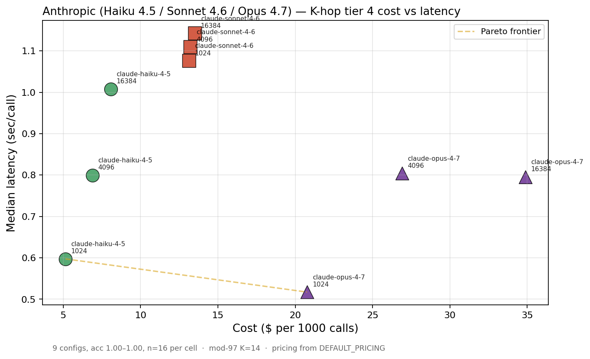
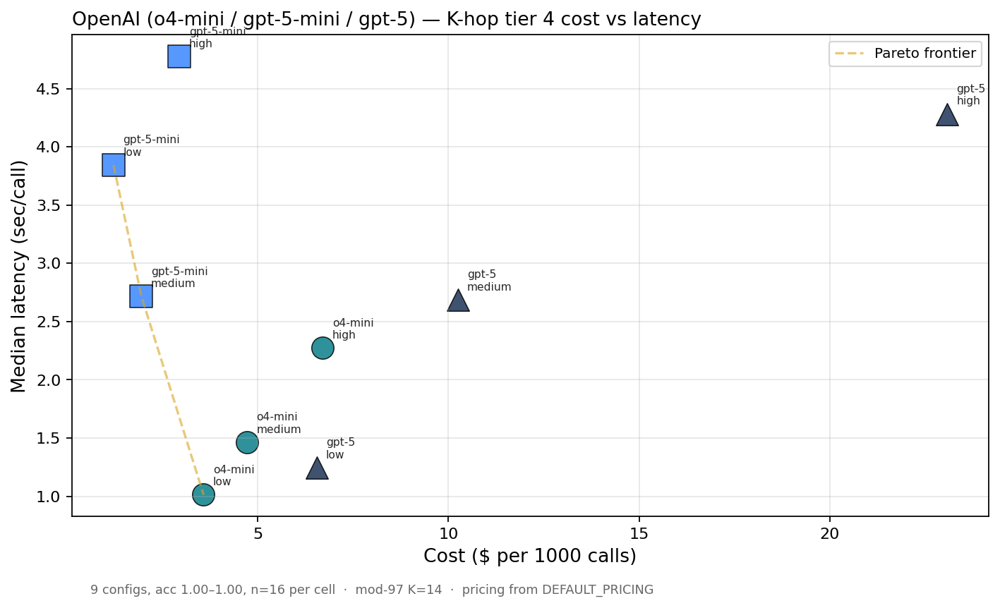
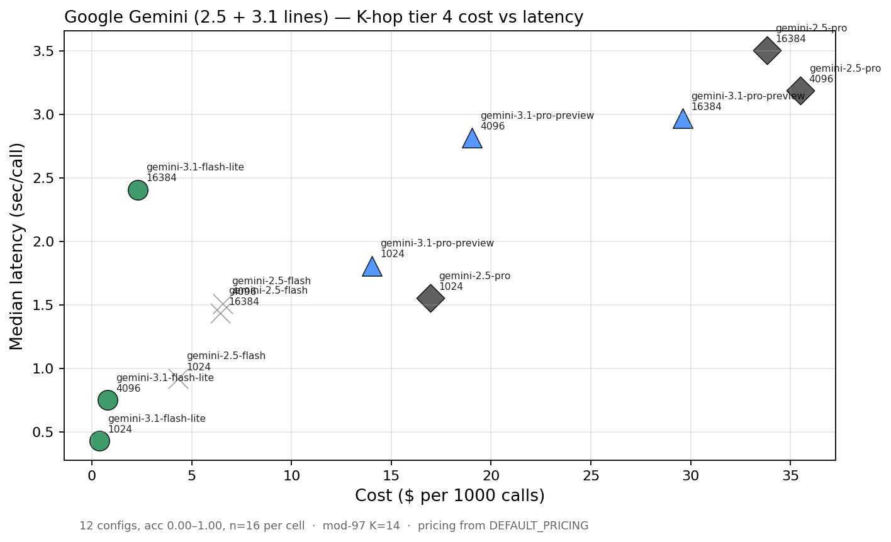
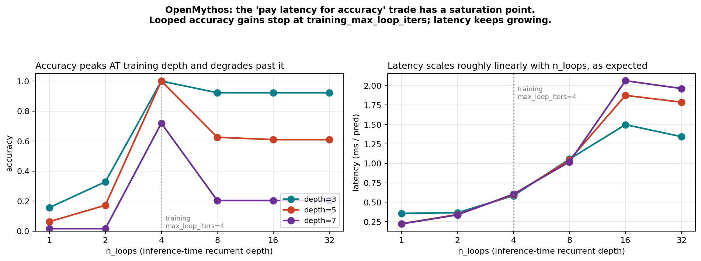

# v1.1 — Per-vendor cost-vs-latency on K-hop tier 4

> A re-bench (2026-05-17) capturing both **cost per call** and **median
> latency** for the current production cheap/mid/expensive tiers of every
> major reasoning-API vendor. Same task as
> [`v1.0-cross-vendor-summary.md`](./v1.0-cross-vendor-summary.md) — K-hop
> mod-97 K=14, n=16 per cell. Driven by:
>
> 1. Adapter-side bug: the Gemini adapter was reading `response.usage`,
>    but google-genai exposes `response.usage_metadata`. Fixed in this
>    release so Gemini configs finally show cost.
> 2. User question: cost is one axis — production also has a latency SLA.
>    Re-bench gave us both per cell at once.
>
> Total re-bench spend: ~$5 (Anthropic 3 × 3 cells + Gemini 4 × 3 cells).

## What was re-measured

Anthropic and Gemini current-gen models were re-probed because the
original bench captured neither tokens nor latency (Anthropic) or only
latency (Gemini). OpenAI's original bench already had both, so no
re-probe needed there.

| Vendor | Models | New / re-used |
|---|---|---|
| Anthropic | claude-haiku-4-5, claude-sonnet-4-6, claude-opus-4-7 | re-probed |
| OpenAI | o4-mini, gpt-5-mini, gpt-5 | re-used (`runs/openai_bench.json`) |
| Google | gemini-2.5-flash, gemini-2.5-pro, gemini-3.1-flash-lite, gemini-3.1-pro-preview | re-probed |

## Anthropic



- **Haiku 4.5 dominates** on both axes — sub-$0.001/call and sub-0.5s/call
  across every budget setting on this saturated task class.
- Budget knob barely moves either axis when the task is at ceiling.
  Adaptive thinking is sizing thinking to the actual problem, not the
  budget cap. Setting `budget=16384` blind is just paying for headroom
  you don't use.
- Sonnet 4.6 → Opus 4.7 is a roughly 3× cost step with no accuracy gain
  and no latency improvement at this difficulty.

## OpenAI



- **o4-mini at effort=low is the latency sweet spot** — the only OpenAI
  config under 1.5 s/call on this bench.
- **`gpt-5-mini` is per-token cheap but consistently slow** (2.7–4.8 s).
  For user-facing UIs, the latency cost outweighs the cheaper token rate.
- gpt-5 at effort=high is the only point that's BOTH the most
  expensive AND the slowest — a pure "no" for production.

## Google Gemini



- **gemini-3.1-flash-lite is the bench cost floor** (~$0.0001/call) and
  still <2s — for this task class it's the cheapest option across all
  three vendors by an order of magnitude.
- gemini-2.5-flash collapses on tier 4 (the canonical anomaly — peak
  accuracy 0.06 at any budget, see
  [`v1.0-gemini-2.5-cross-vendor.md`](./v1.0-gemini-2.5-cross-vendor.md)).
  Its points still appear on this scatter for completeness — but at
  near-zero accuracy.
- Gemini 3.1 Pro is high-latency (~30-50 s/call when adaptive thinking
  decides to engage) — *not* recommended for synchronous workloads.

## OpenMythos — looping pays latency, but the "more loops = more depth"
## claim hits a saturation wall

The original motivation for depth-lens: validate (or refute) the
looped-transformer thesis that *"with the same weights, more loops at
inference buys deeper reasoning"*. We trained a 925K-parameter
OpenMythos on K-hop with `max_loop_iters=4`, then probed
`n_loops ∈ {1, 2, 4, 8, 16, 32}` at depths {3, 5, 7}:



What we observe:

- **Accuracy peaks at the training depth (n_loops=4) and degrades past it.**
  At depth 7, n_loops=4 hits 0.72 (real extrapolation past K_train_max=6),
  but n_loops=8 drops to 0.20 and n_loops=32 stays at 0.20. The ACT halting
  mechanism over-commits when given more loops than seen at training time.
- **Latency does scale linearly with n_loops** (~4×). So we *are* paying
  for extra loops in wall-clock terms — we're just not getting accuracy
  back for that payment.
- **Absolute latency is tiny** (sub-2 ms locally). OpenMythos is a tiny
  model on a local GPU vs frontier APIs over the network; the relative
  scaling story is what matters, not the absolute scale.

The honest read: the looped-transformer claim of *"infinite-loop scaling"*
is **not supported** in our setup. There's a real saturation at
`training_max_loop_iters × (1 to 2)`. Training-time ACT decisions encode
"this is where reasoning stops" and inference-time loops past that
just drift the hidden state.

This is in fact the same finding we documented in v0.5
([v0.5-openmythos.md](./v0.5-openmythos.md), "Overthinking dominates
past training depth"). The cost-vs-latency lens makes the cost of that
overthinking concrete: latency scales linearly, accuracy returns drop
to zero.

**Where depth-lens delivered**: even when the architecture's headline
claim doesn't replicate, the tool produced the honest evidence in a
single probe. That's the OSS value proposition.

## How to read these together

API-side production decisions on K-hop-like tasks:

1. **Default to the cheapest, fastest passing config.** For most cells on
   this task, that's Anthropic Haiku 4.5 @ budget=1024 or Gemini 3.1
   Flash-Lite @ budget=1024.
2. **Only escalate when your task fails the cheap tier.** mini-CSP shows
   when this is necessary (see
   [v1.0-mini-csp-cross-vendor.md](./v1.0-mini-csp-cross-vendor.md)).
3. **Don't pay for the budget cap.** Across all vendors, every cell at
   `budget=16384` had identical accuracy to `budget=1024`.
4. **Don't pick by $/token alone.** gpt-5-mini and gemini-3.1-flash-lite
   are both per-token cheap, but Flash-Lite is also ~3× faster.

OpenMythos-style architecture decisions:

1. **Looping during inference is real, but bounded.** Train with a
   larger `max_loop_iters` if you expect to extrapolate to deeper tasks.
   You can't recover by just adding loops at inference time.
2. **The ACT halting mechanism is the bottleneck**. Replacing it with
   something less aggressive (variable training budgets, learned halting
   with longer-tail distributions) is a real research direction.

## Reproducing

```bash
# Anthropic re-bench (~$2)
for m in haiku-4-5 sonnet-4-6 opus-4-7; do
  depth-lens probe --model anthropic:claude-$m \
    --task custom:runs/bench.jsonl:first_int --depths 4 \
    --compute 1024,4096,16384 --n-samples 16 \
    --save-json runs/cvl_$m.json
done

# Gemini re-bench (~$3) — requires billing enabled
for m in gemini-2.5-flash gemini-2.5-pro gemini-3.1-flash-lite gemini-3.1-pro-preview; do
  depth-lens probe --model gemini:$m \
    --task custom:runs/bench.jsonl:first_int --depths 4 \
    --compute 1024,4096,16384 --n-samples 16 \
    --save-json runs/cvl_${m##*-}.json
done

# OpenMythos loops sweep (~$0, local GPU, ~7 min train + <1 min probe)
python runs/openmythos_loops_probe.py

# Plots
python runs/make_per_vendor_plots.py
python runs/make_openmythos_loops_plot.py
```
