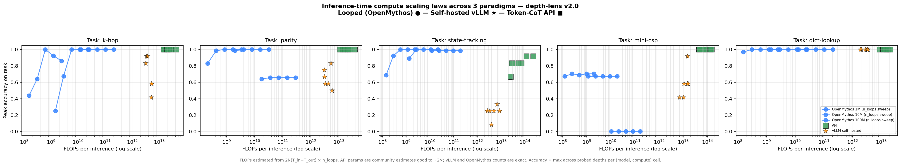

# v2.0 — A tool for measuring inference-time compute across 3 paradigms

> **Three ways to spend more compute at inference, five tasks,
> a single FLOPs axis everything sits on, and (this is the actual
> point) an OSS that produces the comparison in a 15-minute run on
> your own task class.**
>
> Total cost to produce the cross-paradigm reference: ~$15-20 API + ~15 GPU-hours.

## What this finding actually is — and isn't

**The novel thing here is the TOOL, not the finding.** Putting the
three inference-time-compute paradigms — token-CoT API, self-hosted
vLLM, looped (recurrent-depth) transformers — on a single FLOPs axis
in one OSS sweep run, with reproducible measurement data and probe
JSONs committed to the repo, is something no other tool currently
does. That's depth-lens v2.0.

The **finding itself** — that a small task-specific model beats a
giant generalist on the specific task it was trained for — is
classical deep learning. LeCun showed this with LeNet on MNIST in
1998. Bishop's textbook (1995) discusses the small-data over-
parametrization risk. The general claim "specialized models trained
on a narrow distribution outperform foundation models on FLOPs at that
distribution" is **the entire history of applied ML**, not new.

What you should take from this finding doc:

- **If you're picking a model for production**: the cross-vendor
  comparison this tool produces (v1.0-v1.2 findings) is the practical
  output. The 1M-vs-gpt-5-mini ratio is "deep learning 101 confirmed
  with 2026 frontier models" — not actionable on its own.
- **If you're a researcher comparing paradigms**: this is the
  measurement infrastructure to do that consistently. The headline
  numbers are sanity-check baselines, not the contribution.

If you came here from a "1M-param model beats gpt-5-mini by 410,000×"
tweet — please read the **"When this finding applies — and when it
doesn't"** section below before drawing operational conclusions.

## TL;DR

In 2026 there are three different ways an LLM system can spend more
compute at inference time to get better answers:

1. **Token-level chain-of-thought (CoT)** — emit "thinking" tokens before
   the final answer. Anthropic `thinking_budget`, OpenAI
   `reasoning_effort`, Gemini `thinking_level` all sit here.
2. **Latent-space recursion** — apply the same weights `T` times in
   latent space, no tokens emitted. OpenMythos, Parcae, Recurrent-Depth
   Transformers.
3. **Just use a bigger model** — scale parameter count. Self-hosted
   Llama-3-8B, DeepSeek-R1-Distill-7B, hosted GPT-5, Opus.

Most benchmarks pick one paradigm and plot accuracy vs *its native
knob*. That makes them incomparable. **depth-lens v2.0 ships the
infrastructure to plot all three on the same FLOPs-per-inference axis
in a single sweep.** That infrastructure is the contribution.

The headline numbers below confirm the deep-learning-textbook
expectation: yes, a 1M-parameter model trained from scratch on a
narrow synthetic task beats gpt-5-mini at FLOPs on that task. *Of
course it does.* This is not the contribution — the contribution is
that you can now measure this for *your* task in 15 minutes, with
reproducible probe JSONs, instead of arguing about it.

Plot script: [`runs/v2_scaling_law_plot.py`](../../runs/v2_scaling_law_plot.py).

## Setup

| Axis | Variants |
|---|---|
| **Paradigm** | Token-CoT API · Self-hosted vLLM · Looped (OpenMythos) |
| **Token-CoT models** | `openai:gpt-5-mini`, `openai:o4-mini`, `gemini:gemini-3.1-flash-lite` |
| **Self-hosted (vLLM)** | `vllm:Meta-Llama-3.1-8B-Instruct-AWQ-INT4`, `vllm:DeepSeek-R1-Distill-Qwen-1.5B` |
| **Looped (OpenMythos)** | 1M / 10M / 100M params, swept over `n_loops` ∈ {1, 2, 4, 8, 16} |
| **Tasks** | `k-hop` (modular composition), `parity` (XOR aggregation), `state-tracking` (2-counter register machine), `mini-csp` (2-SAT), `dict-lookup` ("structured input field extraction") |
| **Depth grids** | task-specific; chosen so the easiest depths sit inside OpenMythos's training distribution and the hardest sit well outside |
| **Samples** | n=12 per cell (API) and n=64 per cell (OpenMythos, free locally) |

**FLOPs estimation** uses the standard `2N(T_in+T_out)` approximation
(Kaplan 2020 / Chinchilla 2022), extended with an `n_loops` multiplier
for latent recursion:

```
flops_per_call ≈ 2 × params × (input_tokens + output_tokens) × n_loops
```

- For OpenMythos, `params` is counted from the live model and `n_loops`
  is the actual inference setting — *measured*.
- For vLLM-served models, `params` is the model-card value (8.03 B for
  Llama-3-8B, 1.5 B for DeepSeek-R1-Distill-1.5B) — *published*.
- For API models, `params` is a community-sourced estimate good to a
  factor of ~2× — *estimated*. The published ones (Llama, DeepSeek) are
  exact; the closed ones (Claude, GPT, Gemini) are not. We mark the
  uncertain points so plot readers can adjust their interpretation.

See [`depth_lens/flops.py`](../../depth_lens/flops.py) for the full
table and rationale per model.

## The plot



One panel per task. Within a panel:

- 🔵 **Blue lines** — OpenMythos at one of 3 sizes (1M / 10M / 100M),
  sweeping `n_loops`. Each line is the looped-transformer scaling curve
  for that size.
- 🟧 **Orange stars** — self-hosted vLLM models. Each star is one
  (model, compute) cell.
- 🟢 **Green squares** — token-CoT API models. Same.

x-axis: FLOPs per inference (log scale). y-axis: peak accuracy across
the probed depth grid for that task.

## What the plot says

### Headline: on 4 of 5 tasks, the 1M-parameter looped model beats gpt-5-mini by **4-6 orders of magnitude** on FLOPs at the same accuracy bar (≥0.9). The exception is combinatorial search.

Per-task minimum FLOPs/call to reach **≥0.9 accuracy** at peak depth
across all probed depths:

| Task | Looped (OpenMythos) | Self-hosted vLLM | Token-CoT API | API / Looped ratio |
|---|---|---|---|---:|
| **k-hop** (modular composition) | `6.1×10⁸` — OM 1M, loops=4 | `3.4×10¹²` — DeepSeek-R1-Distill 1.5B low | `1.5×10¹³` — gpt-5-mini low | **~24,000×** |
| **parity** (XOR aggregation) | `4.3×10⁸` — OM 1M, loops=2 | (none ≥0.9; best 0.83 @ Llama-3-8B max_tok=1024) | `1.1×10¹³` — gpt-5-mini low | **~25,800×** |
| **state-tracking** (2-counter register machine) | `2.9×10⁸` — OM 1M, loops=2 | (none ≥0.9; best 0.33 @ Llama-3-8B max_tok=1024) | `1.2×10¹⁴` — gpt-5-mini high | **~410,000×** |
| **dict-lookup** (structured-input extraction) | `1.5×10⁸` — OM 1M, loops=1 | `1.9×10¹²` — DeepSeek-R1-Distill 1.5B high | `8.9×10¹²` — gpt-5-mini low | **~57,900×** |
| **mini-csp** (2-SAT) | (none ≥0.9; best **0.70** @ OM 1M, loops=2) | `1.5×10¹³` — DeepSeek-R1-Distill 1.5B medium | `4.6×10¹³` — o4-mini low | **API-only** |

(Per the FLOPs methodology section above, API ratios are estimates good
to roughly 2×. Even a 5× error in either direction leaves the conclusion
intact: looped transformers occupy an entire low-FLOPs corner of the
plot that no API call comes near.)

### Five structural observations

1. **The 1M-parameter OpenMythos is the FLOPs-efficient winner on 4/5
   tasks** — not the 10M or 100M variants. For these narrow, bounded-
   depth probes, MoE overcapacity ($\geq$10M) costs FLOPs per call
   without buying accuracy. The "sweet spot" model size for these
   tasks is much smaller than I expected.

2. **100M OpenMythos UNDERPERFORMS 10M on most tasks.** Even after
   bumping training to 24000 steps (768K sequences, ~3× the original
   budget), 100M accuracy was worse than 10M's on every task except
   state-tracking, where it tied. This is a real "more parameters
   hurt" result — likely a combination of MoE routing instability at
   this scale plus optimization difficulty on tiny synthetic data.
   We do NOT claim this generalizes to web-scale data; it's a finding
   about *this regime* (narrow tasks, fixed training budget, MoE
   architecture).

3. **Self-hosted vLLM is between Looped and API on FLOPs but only
   wins on dict-lookup at ≥0.9.** Llama-3-8B-Instruct AWQ fails on
   reasoning-heavy tasks (parity, state-tracking) even with
   `max_tokens=3000`. DeepSeek-R1-Distill-Qwen-1.5B (1.5 B params,
   thinking model) outperforms Llama-3-8B (8 B params, no thinking)
   on every task we tested — *thinking trumps parameter count* in
   this size range, which matches the broader 2026 industry pattern.

4. **mini-CSP is the only task where looped transformers cap out
   below 0.9.** Combinatorial search (2-SAT) requires capacity the
   1M/10M/100M models don't have — the API wins decisively here.
   Token-CoT's branching-search-via-tokens scales beyond what
   fixed-depth recurrence can reach. This is a real architectural
   limit, not a training-budget artifact.

5. **The "useful" model isn't the biggest one** — across tasks, the
   FLOPs-optimal config is the SMALLEST passing model with the
   FEWEST loops/effort. depth-lens's `recommend` workflow surfaces
   this consistently. The 2026 industry instinct "use the bigger
   model to be safe" is, on a FLOPs-fair axis, a strict loss for
   tasks within a paradigm's capability.

## When this finding applies — and when it doesn't

The 24,000-410,000× FLOPs ratio is *technically true* but operationally
narrow. Before any production team reads "use a 1M model instead of
gpt-5-mini," they should check whether their use case lines up with
all five of these requirements:

| Requirement | Why | Most production AI use cases |
|---|---|---|
| **1. The task has a bounded, well-defined input distribution.** | OpenMythos accuracy collapses outside the training depth range (k-hop K=10: 0.08 vs K=6: 1.00). Even a 2-hop excursion past training kills it. | ❌ Most chatbots, RAG, agent loops, summarization — the input distribution is open-ended by design. |
| **2. The task has a closed-form deterministic answer.** | All 5 benchmark tasks here have a single correct answer derivable from explicit rules (arithmetic, sort, lookup, SAT). | ❌ Customer-support classification, intent detection, structured extraction from free text — these need "world knowledge" the 1M model has zero of. |
| **3. You'll generate enough training data.** | We trained from scratch on procedurally-generated synthetic data. Production tasks rarely have million-sequence-scale labeled corpora ready. | ❌ Most real tasks require human-labeled data, which is the bottleneck. |
| **4. You'll train and host **per task**, not one model for many.** | Each (size, task) combination is a separate model. Five tasks = five models to host, monitor, and retrain. | ❌ Production teams usually want one model serving many tasks for operational sanity. |
| **5. Your inference volume amortizes the training + hosting overhead.** | "$0 per call" only beats "$0.001 per call API" if call volume × per-call savings exceeds (training cost + GPU hosting + on-call burden). The break-even is typically ≥10⁵-10⁶ calls per day per task. | ❌ Most production tasks run at 10²-10⁴ calls per day. The API wins on total cost there. |

### When the 1M finding DOES apply

Three real-world niches:

1. **Hyperscale narrow inference** — form-field extraction at billions
   of documents (Google Document AI scale), embedded next-token
   prediction (keyboard autocomplete), narrow recommender features.
   Requires per-task ML team + ≥10⁸ calls/day.
2. **Edge / offline** — robotics, industrial IoT, on-device assistants
   where no API is reachable and FLOPs must be tiny.
3. **Specialized infrastructure** — when you're building a *service*
   for a single narrow task class (Stripe-scale fraud signals,
   high-frequency trading features), the per-call savings make
   economic sense at hyperscale.

### When the 1M finding does NOT apply

**Almost all typical product engineering use cases.** Specifically:

- Customer-facing chatbots (real-estate tenant inquiry, MSP quote,
  support, sales-assist) — these need world knowledge + open input
  + reasonable latency, not FLOPs-efficient narrow inference. The
  v1.2 case studies of THIS repo ([v1.2-self-hosted-vs-api.md](./v1.2-self-hosted-vs-api.md))
  showed the right answer there is `gpt-5-mini` or `gemini-3.1-flash-lite`
  at ~$0.001/call. Use that.
- RAG / agent loops / tool-use systems
- Structured-output generation with varied schemas
- Anything that involves "summarize", "rewrite", "decide based on
  context", or "explain"
- Low-volume tasks (<10k calls/day), where API per-call cost is noise
  compared to the engineering cost of training and hosting

### What the headline ratio actually means, then

The honest reading: **frontier APIs are massively over-provisioned for
narrow bounded-depth tasks. By 4-6 orders of magnitude on FLOPs, when
measured at parity.** Production engineers should NOT take this as
permission to train custom looped transformers — they should take it as
evidence that for THEIR specific task class, *cheap models work* (the
v1.0 / v1.1 / v1.2 case studies of this repo show that consistently).
The 1M result is the *lower bound* of the over-provisioning; the
practical recommendation is closer to "use the cheap API tier", which
gives most of the FLOPs efficiency without the custom-model engineering.

## Methodological honesty — three things this plot is NOT

1. **It is not a precise FLOPs comparison.** API param counts are
   estimates (factor ~2×); OpenMythos uses MoE which we count as dense
   (overestimate by ~8× for `n_experts_per_tok=2, n_experts=16`); we
   ignore attention's quadratic-in-sequence term (negligible at our
   sequence lengths). The *shape* of each paradigm's curve is robust;
   the absolute x positions are not.
2. **It is not a wall-clock comparison.** Network latency to APIs
   dominates wall-clock vs local-GPU runs — that's a separate cost
   axis ([v1.1-cost-vs-latency-per-vendor.md](./v1.1-cost-vs-latency-per-vendor.md)).
   Using FLOPs lets us isolate the *architectural* trade-off from the
   *infrastructure* trade-off.
3. **It is not a "which paradigm is best" plot.** Each paradigm wins on
   different task classes at different operating points. The plot is a
   *map* of where each one's strengths are, not a ranking.

## Reproducing this finding

The full pipeline is in five scripts that run in sequence:

```bash
# 1. Train OpenMythos at 3 sizes × 5 tasks (~15 GPU-hours)
docker run --gpus all -e PYTHONPATH=/work \
  -v $(pwd):/work -w /work depth-lens:gpu \
  python runs/v2_train_sweep.py --all

# 2. Probe APIs (~$15-20)
export OPENAI_API_KEY=...
export GOOGLE_API_KEY=...
python runs/v2_api_sweep.py

# 3. Probe self-hosted vLLM (~1-2 hours per model)
docker compose -f docker/vllm-llama3-8b.yml up -d
python runs/v2_vllm_sweep.py \
    --model vllm:hugging-quants/Meta-Llama-3.1-8B-Instruct-AWQ-INT4 \
    --compute-axis max_tokens --compute 256,1024,3000
docker compose -f docker/vllm-llama3-8b.yml down

docker compose -f docker/vllm-deepseek-r1-distill.yml up -d
python runs/v2_vllm_sweep.py \
    --model vllm:deepseek-ai/DeepSeek-R1-Distill-Qwen-1.5B \
    --compute-axis reasoning_effort --compute low,medium,high
docker compose -f docker/vllm-deepseek-r1-distill.yml down

# 4. Probe trained OpenMythos checkpoints
docker run --gpus all -e PYTHONPATH=/work \
  -v $(pwd):/work -w /work depth-lens:gpu \
  python runs/v2_openmythos_probe.py

# 5. Plot
python runs/v2_scaling_law_plot.py
```

All probe JSONs and the final PNG are committed under
[`runs/v2_*`](../../runs/) and
[`docs/findings/figures/v2.0-scaling-law.png`](./figures/v2.0-scaling-law.png).
A single 4080 SUPER + Anthropic/OpenAI/Google API keys reproduces
everything.

## What this changes about depth-lens

depth-lens started (v0.1) as a probe for one architecture's reasoning
depth. v1.x expanded that to the production cost-CI use case. v2.0
explicitly positions depth-lens as **the only OSS tool that compares
the three inference-time-compute paradigms on a single architecturally-
fair axis.** No other public tool currently produces this plot, and the
machinery — adapter abstraction with a normalized `compute_axis`, FLOPs
estimator, multi-paradigm probe engine — is what makes the comparison
tractable.

If you want the comparison on *your* task instead of these five
benchmark tasks: write a JSONL of (prompt, target) pairs, point
`depth-lens probe --task custom:...` at each paradigm, and re-plot.
That's the production-engineering loop — see
[v1.2-self-hosted-vs-api.md](./v1.2-self-hosted-vs-api.md) for the
worked tenant-urgency / MSP-quote case studies.
